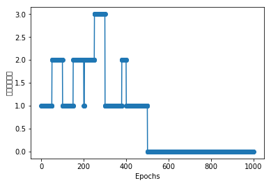

```python
import numpy as np
class Perceptron():
    def __init__(self,eta=0.01,n_iter=10):#eta为学习率，n_iter 为迭代次数
        self.eta=eta
        self.n_iter=n_iter
    def fit(self,x,y):#x,为输入的训练样本，y,为结果向量
        self.w_=np.zeros(1+x.shape[1])#x.shape为向量的行列，加1的原因为加入阀值
        self.errors_=[]#设置偏差初始化为空
        for _ in range(self.n_iter):
            errors=0
            for xi,target in zip(x,y):
                update=self.eta*(target-self.predict(xi))
                self.w_[1:]+=update*xi
                self.w_[0]+=update
                errors+=int(update !=0.0)
                self.errors_.append(errors)
    def net_input(self,x):
        return np.dot(x,self.w_[1:])+self.w_[0]
    def predict(self,x):
        return np.where(self.net_input(x)>=0.0,1,-1)
            
```


```python
file = 'http://archive.ics.uci.edu/ml/machine-learning-databases/iris/iris.data'
import pandas as pd
df =pd.read_csv(file,header=None)
df.head(10)
```


<div>
<style>
    .dataframe thead tr:only-child th {
        text-align: right;
    }

    .dataframe thead th {
        text-align: left;
    }

    .dataframe tbody tr th {
        vertical-align: top;
    }
</style>
<table border="1" class="dataframe">
  <thead>
    <tr style="text-align: right;">
      <th></th>
      <th>0</th>
      <th>1</th>
      <th>2</th>
      <th>3</th>
      <th>4</th>
    </tr>
  </thead>
  <tbody>
    <tr>
      <th>0</th>
      <td>5.1</td>
      <td>3.5</td>
      <td>1.4</td>
      <td>0.2</td>
      <td>Iris-setosa</td>
    </tr>
    <tr>
      <th>1</th>
      <td>4.9</td>
      <td>3.0</td>
      <td>1.4</td>
      <td>0.2</td>
      <td>Iris-setosa</td>
    </tr>
    <tr>
      <th>2</th>
      <td>4.7</td>
      <td>3.2</td>
      <td>1.3</td>
      <td>0.2</td>
      <td>Iris-setosa</td>
    </tr>
    <tr>
      <th>3</th>
      <td>4.6</td>
      <td>3.1</td>
      <td>1.5</td>
      <td>0.2</td>
      <td>Iris-setosa</td>
    </tr>
    <tr>
      <th>4</th>
      <td>5.0</td>
      <td>3.6</td>
      <td>1.4</td>
      <td>0.2</td>
      <td>Iris-setosa</td>
    </tr>
    <tr>
      <th>5</th>
      <td>5.4</td>
      <td>3.9</td>
      <td>1.7</td>
      <td>0.4</td>
      <td>Iris-setosa</td>
    </tr>
    <tr>
      <th>6</th>
      <td>4.6</td>
      <td>3.4</td>
      <td>1.4</td>
      <td>0.3</td>
      <td>Iris-setosa</td>
    </tr>
    <tr>
      <th>7</th>
      <td>5.0</td>
      <td>3.4</td>
      <td>1.5</td>
      <td>0.2</td>
      <td>Iris-setosa</td>
    </tr>
    <tr>
      <th>8</th>
      <td>4.4</td>
      <td>2.9</td>
      <td>1.4</td>
      <td>0.2</td>
      <td>Iris-setosa</td>
    </tr>
    <tr>
      <th>9</th>
      <td>4.9</td>
      <td>3.1</td>
      <td>1.5</td>
      <td>0.1</td>
      <td>Iris-setosa</td>
    </tr>
  </tbody>
</table>
</div>


```python
import matplotlib.pyplot as plt
import numpy as np
y=df.loc[0:99,4].values
y=np.where(y=='Iris-setosa',-1,1)
x=df.iloc[0:100,[0,2]].values
plt.scatter(x[:50,0],x[:50,1],color='red',marker='o',label='setosa')
plt.scatter(x[50:100,0],x[50:100,1],color='blue',marker='x',label='versicolor')
plt.xlabel('花瓣长度')
plt.ylabel('花茎长度')
plt.legend(loc='upper left')
plt.show()
```


```python
ppn=Perceptron(eta=0.1,n_iter=10)
ppn.fit(x,y)
plt.plot(range(1,len(ppn.errors_)+1),ppn.errors_,marker='o')
plt.xlabel('Epochs')
plt.ylabel('错误分类次数')
plt.show()
```





```python
from matplotlib.colors import ListedColormap
def plot_decision_regions(x,y,classifier,resolution=0.02):
    markers=('s','x','o','v')
    colors=('red','blue','lightgreen','gray','cyan')
    cmap=ListedColormap(colors[:len(np.unique(y))])
    x1_min,x1_max=x[:,0].min()-1,x[:,0].max()
    x2_min,x2_max=x[:,1].min()-1,x[:,1].max()
    #print(x1_min,x1_max)
    #print(x2_min,x2_max)
    xx1,xx2=np.meshgrid(np.arange(x1_min,x1_max,resolution),np.arange(x2_min,x2_max,resolution))#只是生成网格，而且只用到
    z=classifier.predict(np.array([xx1.ravel(),xx2.ravel()]).T)#T为转制，xx1.ravel为原始列表[ 3.3   3.32  3.34 ...,  6.94  6.96  6.98]
    
    #print(xx1.ravel())
    #print(xx2.ravel())
    
    z=z.reshape(xx1.shape)
    #print('hhh')
    #print(z)
    plt.contourf(xx1,xx2,z,alpha=0.4,cmap=cmap)#并非画线，只是将颜色填充。
    plt.xlim(xx1.min(),xx1.max())
    plt.ylim(xx2.min(),xx2.max())
    #print(np.unique(y))
    for idx,cl in enumerate(np.unique(y)):
        #print(x[y==cl,0],cl,x)
        plt.scatter(x=x[y==cl,0],y=x[y==cl,1],alpha=0.8,c=cmap(idx),marker=markers[idx],label=cl)#通过检测x的索引提取值，
        
```


```python
plot_decision_regions(x,y,ppn,resolution=0.02)
plt.xlabel('花瓣长度')
plt.ylabel('花茎长度')
plt.legend(loc='upper left')
plt.show()
```


```python
class AdalineGD():
    def __init__(self,eta=0.01,n_iter=50): 
        self.eta=eta
        self.n_iter=n_iter
    def fit(self,x,y):
        self.w_=np.zeros(1+x.shape[1])
        self.cost_=[]
        for i in range(self.n_iter):
            output=self.net_input(x)
            errors=(y-output)
            self.w_[1:]+=self.eta*x.T.dot(errors)
            self.w_[0]+=self.eta*errors.sum()
            cost=(errors**2).sum()/2.0
            self.cost_.append(cost)
        return self
    def net_input(self,x):
        return np.dot(x,self.w_[1:])+self.w_[0]
    def activation(self,x):
        return self.net_input(x)
    def predict(self,x):
        return np.where(self.activation(x)>=0,1,-1)
```


```python
ada=AdalineGD(eta=0.0001,n_iter=500)
ada.fit(x,y)
plot_decision_regions(x,y,classifier=ada,resolution=0.02)
plt.title('Adaline-Gradient descent')
plt.xlabel('花径长度')
plt.ylabel('花瓣的长度')
plt.show()
#print(ada.cost_)
```


```python
plt.plot(range(1,501),ada.cost_,marker='o')
plt.show()
```


```python

```
